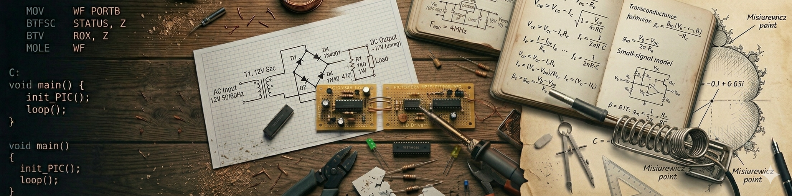

  

# Alessandro Fraschetti

Software engineer by profession, electronics maker and *science explorer* by inclination. 
Interests that show up in the math, in the circuits, and occasionally in the way I think about everything else.
 
---

I write software (by day) long enough to have started before Stack Overflow existed. 
Outside of work (by night), I maintain my GitHub as a digital workbench where I track my long-term projects:
building electronics, documenting experiments, maintaining a small, slow-burning software library for abstract algebra, alongside a modular hardware library of single-function boards (MOBs) for prototyping, and even making vintage floppy disk drives play music.
I also play the piano and have a complicated relationship with Genesis.

Some repositories are carefully documented, others are rough sketches. I may come back to refine them, or quietly delete them. That's just part of how this workbench works, with sawdust on the floor and half-finished prototypes.

---
 
## The Hubs (Suites)
 
This account is organized around a few thematic hubs (the suites).
Each suite is an index of repositories grouped by topic.

- **[electronic suite](https://github.com/gom9000/gos-electronic-suite)** - lab instruments, documented experiences, component libraries, projects
- **[software suite](https://github.com/gom9000/gos-software-suite)** - utilities, funnies, old projects, very old projects
- **[music suite](https://github.com/gom9000/gos-music-suite)** - instruments, effects, sheet music, utility projects
- **[explore suite](https://github.com/gom9000/gos-explore-suite)** - algebra, fractals, home-made scientific experiences

For a full picture of what's here, start from the hubs - though some repositories live outside them: older experiments, rough sketches, or things not yet worth a hub.

***Note on organization**: These suites are organized by domain and purpose, not by technology.
You will find firmware and code within the electronic suite when they serve the project, and hardware designs within the music suite when their goal is a musical tool. The software suite is reserved for pure computing utilities.*

---
 
*Rome, Italy — [gommagomma.net](http://www.gommagomma.net)*
